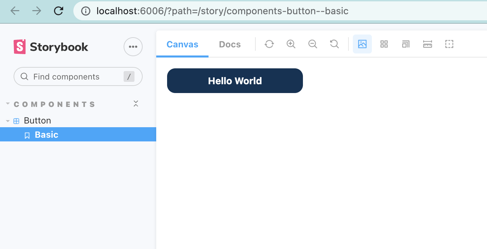
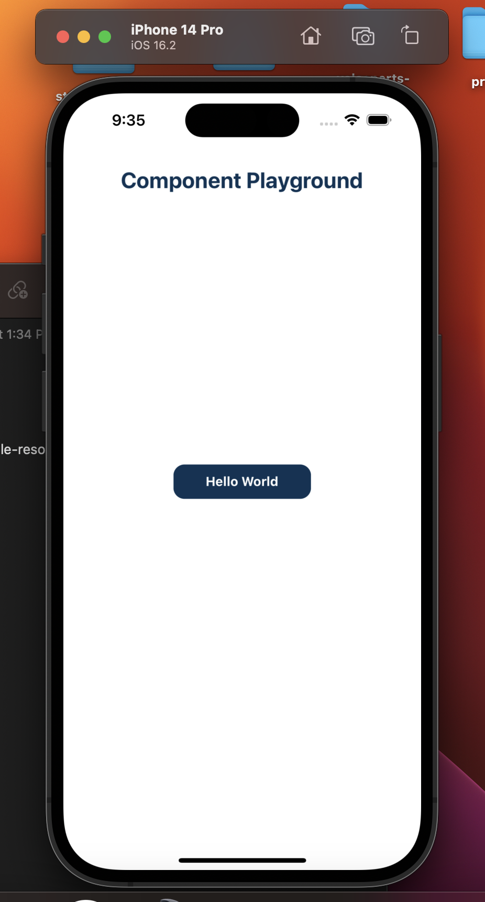

# React Native Web Component Library

## About

This is a basic setup for a cross-platform component library using React-Native/React-Native-Web, TypeScript and Storybook.
It utilizes <b><a href="https://docs.expo.dev/">Expo</a></b> in development alongside storybook, which allows developers to easily spin up a playground on their mobile-device OR simulator to view their component as they're making changes, <i>without</i> having to publish or deploy code. Build scripts compile the code to individual web and mobile packages, minimizing bundle size and complexity of setup by the consumer.

<hr>

## Installing

```
yarn install
```


## Open Storybook

```
yarn storybook
```

<br>



<br>

## Launch Expo
<strong>Used to launch mobile environment</strong>

```
yarn start
```
<strong> ** Requires setup for iOS and Android ** </strong><br>
Follow the command line instructions to select an environment. Scanning the QR code to launch on your device requires you to download the Expo Go app. Your device must also be connected to the same network as your computer. More information on this can be found here: <a href="https://docs.expo.dev/workflow/run-on-device/">https://docs.expo.dev/workflow/run-on-device/</a>

<br>



<br>

# Building

```
yarn build
```
The build command compiles the code into the <code>build/{package}</code> directory. It executes in the following phases:

- Remove output directories from previous build
- Compile TypeScript to build/{package}/src and declarations to build/{package}/lib
- Modify web <code>react-native</code> imports to <code>react-native-web</code> 
- Compile code to EsModule and CommonJs with Rollup
- Remove build/{package}/src directory

<br>

To test the builds locally, you can open up another project and use a relative import to the build/{web|mobile} folder, ensuring that all peer dependecies are installed.

<br>

# Demo


### The demos are available on NPM

<a href="https://www.npmjs.com/package/@jhahn678/web"><p>https://www.npmjs.com/package/@jhahn678/web</p></a>

<a href="https://www.npmjs.com/package/@jhahn678/mobile"><p>https://www.npmjs.com/package/@jhahn678/mobile</p></a>

<br>

### In an existing web project:

```
yarn add @jhahn678/web react-native-web
```
### In an existing react-native project:

```
yarn add @jhahn678/mobile
```
<br><br>

# Other Scripts

### Launch on android simulator
```
yarn android
```
### Launch on iOS simulator
```
yarn ios
```
### Launch expo in browser
```
yarn web
```
### Build mobile and web packages
```
yarn build
```
### Build mobile package
```
yarn build:mobile
```
### Build web package
```
yarn build:web
```
### Build and create package analytics 
<i>@build/{package}/lib/stats.html</i>

```
yarn build:analyze
```

<br><hr>

TODO:

- [x] Functioning build process
- [ ] Configure dependencies so that web consumers don't have to install additional packages manually ?? If possible ??
- [ ] Automatic generation of Prop-Types
- [ ] Automatic versioning
- [x] Configure NPM publishing
- [x] Configure install pattern so consumers can <code>yarn add @library/{web/mobile}</code> without installing both bundles

## References

https://www.npmjs.com/package/replace-in-file#replace-multiple-files-or-globs
